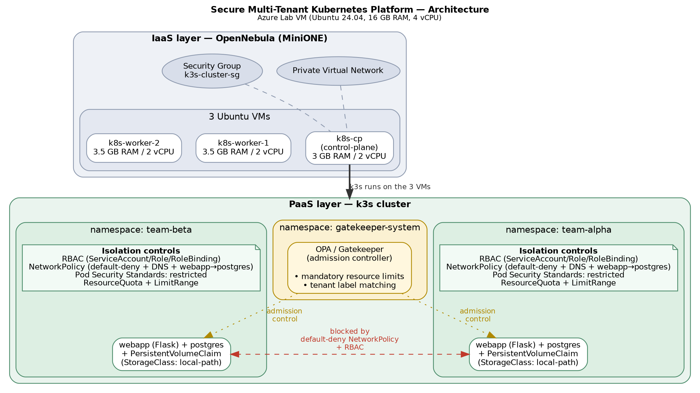

# Secure Multi-Tenant Kubernetes Platform on OpenNebula IaaS

Fog and Cloud Computing (145771) — University of Trento
Alessandro Brognara (261216) · Lorenzo Bergami (266671)

## Project Description

This project implements a secure multi-tenant Kubernetes platform deployed on top of an
OpenNebula IaaS layer running on an Azure lab VM. Two simulated tenants (`team-alpha`,
`team-beta`) share the same physical Kubernetes cluster while being isolated through five
independent, layered security mechanisms:

- **RBAC** — per-tenant ServiceAccount/Role/RoleBinding, scoping API access to each tenant's own namespace
- **NetworkPolicy** — default-deny-all with explicit allow rules (DNS scoped to CoreDNS pods only, tenant-internal traffic only)
- **Pod Security Standards** — `restricted` profile enforced at namespace level
- **OPA/Gatekeeper** — custom admission policies (mandatory resource limits, tenant label matching)
- **ResourceQuota / LimitRange** — namespace-level caps on total CPU/memory and pod count, closing the noisy-neighbor gap left open by Gatekeeper's per-pod-only enforcement

Each tenant runs an identical demo web application (Flask + Postgres task board), deliberately
kept as the *same* container image for both tenants — the isolation guarantee comes entirely
from the platform, not from the application itself.

## Architecture



Summary:

```
Azure Lab VM (Ubuntu 24.04, 16 GB RAM, 4 vCPU)
│
├── OpenNebula (MiniONE) — IaaS layer
│   ├── Private Virtual Network
│   ├── Security Group "k3s-cluster-sg"
│   └── 3 Ubuntu VMs:
│       ├── k8s-cp       (control-plane, 3 GB RAM, 2 vCPU)
│       ├── k8s-worker-1 (3.5 GB RAM, 2 vCPU)
│       └── k8s-worker-2 (3.5 GB RAM, 2 vCPU)
│
└── k3s runs on the 3 VMs — PaaS layer
    ├── namespace team-alpha   (webapp + postgres + PVC on local-path,
    │                           PSS restricted, ResourceQuota + LimitRange)
    ├── namespace team-beta    (webapp + postgres + PVC on local-path,
    │                           PSS restricted, ResourceQuota + LimitRange)
    └── namespace gatekeeper-system (OPA Gatekeeper)
```

**Local development note:** since VM access was granted partway through the project, most of
the Kubernetes-layer work (namespaces, RBAC, NetworkPolicy, Gatekeeper, ResourceQuota/LimitRange,
workloads) was developed and validated on a local [k3d](https://k3d.io/) single-node cluster
before being deployed to the real 3-node cluster. k3d runs actual k3s in Docker, including the
same kube-router-based NetworkPolicy controller used in production — see `docs/environment.md`
for details.

## Prerequisites

- Access to the Azure Lab VM (OpenNebula/FireEdge)
- `kubectl`
- `k3s` (installed automatically by the setup scripts)
- Docker (for building the demo webapp image)

## Setup

### 1. IaaS Provisioning

See `iaas/` for OpenNebula VM templates and provisioning notes (Lorenzo — Fase 1).

### 2. Cluster Bootstrap

k3s install on control-plane and workers. See `docs/environment.md` for the real VM IPs and
bootstrap commands (Lorenzo — Fase 2).

### 3. Build and Import the Webapp Image

```bash
cd app
docker build -t team-webapp:local .
cd ..

# Local k3d cluster:
k3d image import team-webapp:local -c fcc-dev

# Real k3s cluster (on the VM):
docker save team-webapp:local | ssh <vm-host> sudo k3s ctr images import -
```

### 4. Create the Postgres Secrets

Credentials are kept out of version control (see `k8s/04-workloads/*.env.example`).
Copy each example, fill in real values, then generate the Secret imperatively:

```bash
cp k8s/04-workloads/postgres-alpha.env.example k8s/04-workloads/postgres-alpha.env
cp k8s/04-workloads/postgres-beta.env.example k8s/04-workloads/postgres-beta.env
# edit both files with real credentials, then:

kubectl create secret generic postgres-credentials \
  --from-env-file=k8s/04-workloads/postgres-alpha.env --namespace=team-alpha

kubectl create secret generic postgres-credentials \
  --from-env-file=k8s/04-workloads/postgres-beta.env --namespace=team-beta
```

### 5. Applying the Manifests

Manifests must be applied in the order given by the folder prefixes. `00-namespaces/` includes
the ResourceQuota and LimitRange for each tenant alongside the namespace definitions:

```bash
kubectl apply -f k8s/00-namespaces/
kubectl apply -f k8s/01-rbac/
kubectl apply -f k8s/02-networkpolicy/
kubectl apply -f k8s/03-gatekeeper/
kubectl apply -f k8s/04-workloads/
```

If deploying to a cluster with different worker capacity than the local dev environment,
recalibrate the CPU/memory values in `k8s/00-namespaces/resourcequota-*.yaml` and
`limitrange-*.yaml` before applying — see the comment header in each file.

### 6. Access the Webapp

```bash
kubectl port-forward -n team-alpha svc/webapp 5000:5000
kubectl port-forward -n team-beta svc/webapp 5001:5000
```

Open `http://localhost:5000` (Team Alpha) and `http://localhost:5001` (Team Beta).

On the real cluster, the webapp Service is exposed via NodePort (30081/30082) — reachable
directly at `http://<worker-ip>:30081` without port-forwarding.

## Validation

Run the automated validation suite, which covers RBAC isolation, NetworkPolicy enforcement,
Pod Security Standards, Gatekeeper admission policies, and ResourceQuota/LimitRange enforcement
(11 automated checks):

```bash
./scripts/validate.sh
```

See `docs/environment.md` for a detailed write-up of testing methodology and issues encountered
during development (e.g. the kube-router REJECT-vs-timeout behavior, PSS securityContext
requirements for Postgres, the admission controller evaluation order — PSS → Gatekeeper →
LimitRange → ResourceQuota — discovered while testing the noisy-neighbor fix).

## Cleanup

```bash
# Local k3d cluster:
k3d cluster delete fcc-dev

# Real cluster — remove workloads only, keep infrastructure:
kubectl delete -f k8s/04-workloads/
kubectl delete -f k8s/03-gatekeeper/
kubectl delete -f k8s/02-networkpolicy/
kubectl delete -f k8s/01-rbac/
kubectl delete -f k8s/00-namespaces/
```

## Repository Structure

```
.
├── docs/                environment.md (setup notes, issues log), architecture.png,
│                        proposal, final report
├── iaas/                OpenNebula templates and configuration
├── k8s/
│   ├── 00-namespaces/   tenant + gatekeeper-system namespaces, ResourceQuota, LimitRange
│   ├── 01-rbac/         per-tenant ServiceAccount/Role/RoleBinding
│   ├── 02-networkpolicy/ default-deny, DNS (scoped to CoreDNS), webapp-to-postgres rules
│   ├── 03-gatekeeper/   ConstraintTemplates + Constraints
│   ├── 04-workloads/    postgres + webapp Deployments/Services/PVCs per tenant
│   └── manual-tests/    ad-hoc pods used to validate policies during development
├── app/                 Flask + Postgres demo webapp (task board), shared image for both tenants
└── scripts/             validate.sh — automated validation suite
```